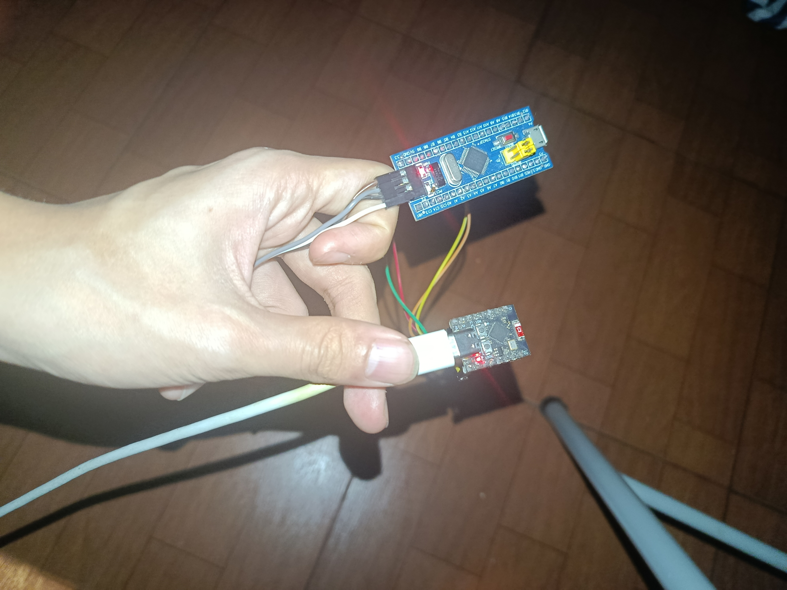
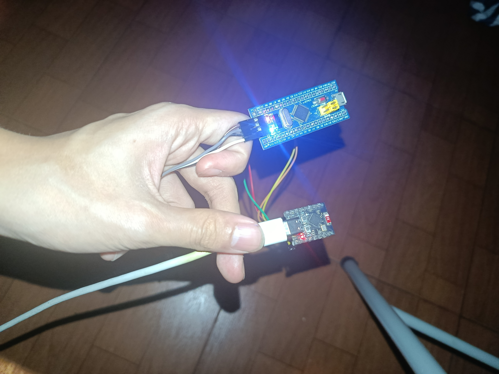

# Tài liệu Lab 1: Giao tiếp UART giữa ESP32 (Master) và STM32 (Slave)

Tài liệu hướng dẫn chi tiết về cấu hình, mạch nối, và cách vận hành dự án `lab1-uart` giao tiếp qua UART với giao thức Modbus RTU.

---

## Mục lục
1. [Định nghĩa các khái niệm cốt lõi](#1-định-nghĩa-các-khái-niệm-cốt-lõi)
   - [1.1 Giao thức UART (Lớp Vật Lý)](#11-giao-thức-uart-lớp-vật-lý)
   - [1.2 Giao thức Modbus RTU (Lớp Phần Mềm / Logic)](#12-giao-thức-modbus-rtu-lớp-phần-mềm--logic)
2. [Sơ đồ chân kết nối (Pinout)](#2-sơ-đồ-chân-kết-nối-pinout)
3. [Cài đặt hệ thống (Configuration)](#3-cài-đặt-hệ-thống-configuration)
   - [3.1 Cấu hình ESP32 (Master)](#31-cấu-hình-esp32-master)
   - [3.2 Cấu hình STM32 (Slave) qua STM32CubeMX](#32-cấu-hình-stm32-slave-qua-stm32cubemx)
4. [Phân tích Mã nguồn (Source Code Analysis)](#4-phân-tích-mã-nguồn-source-code-analysis)
   - [4.1 Code bên Master (ESP32)](#41-code-bên-master-esp32)
   - [4.2 Code bên Slave (STM32)](#42-code-bên-slave-stm32)
5. [Hướng dẫn Biên dịch và Nạp Firmware (Build & Flash)](#5-hướng-dẫn-biên-dịch-và-nạp-firmware-build--flash)
   - [5.1 Hệ thống ESP32 (ESP-IDF)](#51-hệ-thống-esp32-esp-idf)
   - [5.2 Hệ thống STM32 (Sử dụng Makefile hoặc CubeIDE)](#52-hệ-thống-stm32-sử-dụng-makefile-hoặc-cubeide)
6. [Kết quả vận hành (Visual Results)](#6-kết-quả-vận-hành-visual-results)
7. [Các lỗi phát sinh và cách khắc phục](#7-các-lỗi-phát-sinh-và-cách-khắc-phục)

---

> [!NOTE] 
> **Câu chuyện phần cứng:** Tại sao lại cần UART và Modbus?
> Tưởng tượng bạn có hai vi điều khiển, một con đóng vai trò "Giám đốc" (Master - ESP32, có kết nối WiFi) và một con là "Công nhân" (Slave - STM32, chuyên điều khiển bóng đèn, quạt). Làm sao để Giám đốc ra lệnh cho Công nhân? Cách dễ nhất là nối dây điện báo.
> 
> **UART** chính là "sợi dây điện báo" đó (phần cứng vật lý truyền tín hiệu tít - te), còn **Modbus** là "ngữ pháp tiếng Việt" bắt buộc phải dùng trên sợi dây đó để hai bên hiểu nhau. Chuẩn này đặc biệt phổ biến trong các nhà máy công nghiệp nhờ tính bền bỉ, dễ cài đặt và cực kỳ rẻ.

---

## 1. Định nghĩa các khái niệm cốt lõi

### 1.1 Giao thức UART (Lớp Vật Lý)
**UART** (Universal Asynchronous Receiver-Transmitter) là cách mà hai thiết bị ném dữ liệu cho nhau qua dây điện. "Asynchronous" (bất đồng bộ) nghĩa là chúng không dùng chung một nhịp tim (clock), nên cả hai phải "hứa" với nhau sẽ làm việc ở cùng một tốc độ trước khi nói chuyện.

Các thông số này giống như việc cài đặt tần số đài FM, lệch một chút là rè:
- **Baudrate (9600 bps):** Tốc độ ném dữ liệu (9600 bit mỗi giây). 
  - *Thay đổi được không?* Có. Bạn có thể lên 115200 bps cho nhanh, nhưng dây nối càng dài thì tốc độ càng cao lại càng dễ bị nhiễu. Trong công nghiệp, 9600 là tốc độ "chậm mà vô cùng chắc chắn".
- **Data bits (8 bit):** Mỗi lần ném sẽ gom đúng gói 8 bit (1 byte). 
  - *Ông Giám đốc (ESP) có thể tham lam nhồi tụp 9 bit vào một kiện được không?* Trát lời về mặt vật lý là **Hoàn toàn được**, thao tác rất đơn giản: Trình cấu hình STM32 (CubeMX) chỉ việc chọn Word Length = 9 Bits, còn trên ESP32 đổi cờ cài đặt thành `UART_DATA_9_BITS` là xong. 
  - *Nhưng có nên không?* **Tuyệt đối không!** Trong khuôn khổ hiệp ước "Modbus RTU", khung truyền bị niêm phong nghiêm ngặt theo các ngăn 8-bit. Việc nhét thêm 9 hay 10 bit vào một nhịp sẽ đập vỡ trật tự của toàn bộ toa tàu. Thuật toán xác thực CRC ngay lập tức bị tính toán sai lêch nặng, và toàn bộ lô hàng dữ liệu đó lập tức bị quăng vào đống rác. Tốn băng thông vô ích!
- **Parity (None):** Bit dùng để kiểm tra xem gói ném đi có bị lỗi móp méo không. Ở đây ta vứt bỏ tính năng này (None) vì lát nữa giao thức Modbus bên trên có thuật toán CRC16 dọn dẹp lỗi xịn hơn rất nhiều.
- **Stop bits (1 bit):** Dấu chấm hết một câu để thiết bị bên kia kịp lấy hơi.

> [!WARNING]
> Nếu bạn đổi Baudrate trên ESP32 sang `115200` mà STM32 vẫn để `9600`, hệ thống sẽ "điên". ESP32 thì nói quá nhanh, còn STM32 nhận vào toàn các ký tự rác (garbage) hoàn toàn không thể đọc được. Luôn phải cấu hình 2 bên giống hệt nhau!

### 1.2 Giao thức Modbus RTU (qua UART)
### 1.2 Giao thức Modbus RTU (Lớp Phần Mềm / Logic)
Nếu UART là đường cao tốc, thì Modbus RTU chính là "Luật giao thông" và "Các loại xe tải" chạy trên đường đó. 

Modbus hoạt động theo chế độ **Độc tài (Master - Slave)**. Slave (như STM32) sinh ra chỉ để câm lặng lắng nghe. Chừng nào Master (ESP32) chưa gào tên ID của nó, nó sẽ không bao giờ được phép tự ý mở miệng nói. Điều này tránh việc có cả trăm thiết bị cùng nói một lúc gây cháy "đường cao tốc" (thường áp dụng trên xe buýt RS485).

**Cách Master đóng gói 1 chiếc "xe tải" (Frame):**
Hôm nay Giám đốc ESP32 muốn Công nhân STM32 (Mã ID: 01) bật cái đèn (Address: 01). Giám đốc sẽ sử dụng Lệnh số `0x05` (Function Code 05: Ghi biến trạm đơn giá trị ON/OFF).

```text
┌─────────────────┬────────────────┬─────────────────┬───────────────┬──────────────────┐
│ Ai nhận?        │ Làm gì?        │ Ở đâu?          │ Như thế nào?  │ Dấu niêm phong   │
├─────────────────┼────────────────┼─────────────────┼───────────────┼──────────────────┤
│ Slave Address   │ Function Code  │ Coil Address    │ Coil Value    │ Error Check(CRC) │
│ (1 Byte)        │ (1 Byte)       │ (2 Bytes)       │ (2 Bytes)     │ (2 Bytes)        │
├─────────────────┼────────────────┼─────────────────┼───────────────┼──────────────────┤
│ ID: 0x01        │ Lệnh: 0x05     │ 0x00, 0x01      │ 0xFF, 0x00    │ CRC_Low, CRC_High│
└─────────────────┴────────────────┴─────────────────┴───────────────┴──────────────────┘
```

**Giải phẫu chiếc xe tải (Field):**
1. **Slave Address (1 byte):** Biển số của trạm đích (từ 1 tới 247). Chuyến này gửi cho trạm `0x01`. Mọi trạm mang ID số `02` hay `03` đọc được byte này sẽ lập tức nhắm mắt làm ngơ.
  - *Thay đổi được không?* Có. Nếu bạn có 5 cái STM32, hãy nạp code đính ID cho chúng lần lượt là 1, 2, 3, 4, 5. Master lúc này muốn gọi ai thì ném ID đó vào khung truyền.
2. **Function Code (1 byte):** Chỉ định công việc. `0x05` là "Write Single Coil" (Viết 1 bit cho máy bơm / bóng đèn). Ngoài ra nó còn lệnh `0x03` (Đọc cảm biến), `0x06` (Ghi thông số động cơ), v.v.
3. **Coil Address (2 bytes):** Địa chỉ linh kiện bên trong hệ thống Slave. Modbus bắt gửi nửa đầu (byte cao) rồi mới gửi nửa sau (byte thấp) - `0x00` đi trước `0x01`.
4. **Coil Value (2 bytes):** Bạn muốn cái bóng đèn `0x0001` kia ra sao? 
  - Bật (ON): Phải truyền dính chùm `0xFF00`.
  - Tắt (OFF): Phải truyền `0x0000`. Cắn rứt hỏi tại sao không truyền 1 số `1` cho nhẹ? Vì đây là tiêu chuẩn của các máy cày công nghiệp quy định từ thập niên 70 để bo mạch nhận diện chắc chắn không nhầm, ta phải tuân theo.
5. **Error Check - CRC16 (2 bytes):** "Dấu niêm phong sáp". Sinh ra từ chuỗi 6 byte trước đó, nếu qua môi trường không khí bị sấm chớp biến đối 1 bit thôi, mã CRC16 tính lại bằng thuật toán XOR phức tạp sẽ không khớp với cái chốt ở đuôi, cuốc xe này sẽ bị STM32 huỷ và bỏ qua hoàn toàn. Đảm bảo an toàn tuyệt đối, bóng đèn không bao giờ bật sai nhịp!

**Quy trình Giao Tiếp Nhịp Nhàng:**
- **Master (ESP32) gửi lệnh:** Gói ghém 8 byte trên lại thành 1 chuỗi, quăng vào UART.
- **Slave (STM32) nhận & Echo:** STM32 rã dây, xé niêm phong tự tính lại CRC. Đúng ID của mình, CRC giống hệt -> Ok thi hành bật tắt cái đèn chân PC13. Làm xong, để Master không phải bồn chồn lo lắng: "Trời, nãy mình sai nó làm, không biết nó làm chưa?", STM32 bèn sao chép nguyên trạng 8 byte đó gửi dội ngược về ("Echo"). Master nhận được Echo, thở phào nhẹ nhõm, quy trình khép kín!

---

## 2. Sơ đồ chân kết nối (Pinout)

Sơ đồ kết nối phần cứng giữa hai vi điều khiển. Cần phải bảo đảm mức điện áp tương thích (cả ESP32 và STM32F103 đều sử dụng mức logic 3.3V) và phải **nhất thiết nối chung tiếp địa (GND)**.

| Thiết bị | Chân (Pin) | Nối với | Ghi chú |
| :---: | :---: | :---: | :--- |
| **ESP32** | TX (GPIO 4) | STM32 RX (PA10) | UART1 TX của ESP32 |
| **ESP32** | RX (GPIO 5) | STM32 TX (PA9) | UART1 RX của ESP32 |
| **ESP32** | GND | STM32 GND | **Cực kỳ quan trọng:** Không có GND, mạch sẽ chạy loạn xạ |
| **STM32** | PA9 (TX) | ESP32 RX (GPIO 5) | UART1 TX (Nối chéo sang RX của ESP) |
| **STM32** | PA10 (RX) | ESP32 TX (GPIO 4) | UART1 RX (Nối chéo sang TX của ESP) |
| **STM32** | PC13 | N/A | LED xanh tích hợp trên mạch Bluepill |

> [!CAUTION]
> **Tuyệt đối không nối mạch chéo TX - TX, RX - RX!** Dữ liệu truyền đi bắt buộc phải hứng ở cổng nhận (như cái miệng phải nói vào cái tai). Nếu nối TX vào TX, hai bên cùng hét vào nhau gây chập line khiến dữ liệu không thể di chuyển.

---

## 3. Cài đặt hệ thống (Configuration)

### 3.1 Cấu hình ESP32 (Master)
- Chương trình sử dụng ngoại vi `UART_NUM_1` thông qua hàm `uart_param_config()`.
- Chức năng: Viết một vòng lặp `while(1)`, cứ mỗi 2 giây, ESP32 sẽ gửi một frame `0x05` mang lệnh đảo trạng thái Coil (Bật hoặc Tắt) cho Slave ID `0x01` (địa chỉ `0x0001`).
- Sau khi gửi, master có 2 giây để chờ phản hồi thông qua `uart_read_bytes`. Nếu có phản hồi thành công và đúng Function Code, log sẽ in thông báo nhận được.

### 3.2 Cấu hình STM32 (Slave) qua STM32CubeMX
Dự án được khởi tạo cấu trúc bằng công cụ đồ hoạ **STM32CubeMX**, các thiết lập phần cứng (Hardware Configuration) được cài cắm như sau:

**1. Cấu hình RCC & SYS:**
- `RCC -> High Speed Clock (HSE):` Chọn `Crystal/Ceramic Resonator` (Sử dụng thạch anh ngoài 8MHz trên Bluepill).
- `SYS -> Debug:` Đặt thành `Serial Wire` (Bắt buộc để nạp và debug qua mạch ST-LINK).

**2. Cấu hình GPIO (Điều khiển LED):**
- Tìm chân PC13 trên giao diện đồ họa.
- Click chuột trái, chọn cấu hình thành `GPIO_Output`.
- Giữ nguyên thiết lập kéo kéo (Push-pull). Đổi tên dán nhãn (`User Label`) thành "LED_MODBUS" nếu muốn. Mặc định kéo chân này xuống `Low` thì LED Bluepill sẽ sáng.

**3. Cấu hình USART1:**
- Chọn Connectivity -> `USART1`. Mode chọn `Asynchronous`.
- Dưới thẻ **Parameter Settings**: 
   - Baud Rate: 9600 Bits/s.
   - Word Length: 8 Bits (Lưu ý: trên stm32, tính theo khung kể cả parity. Không dùng parity thì chọn 8B).
   - Parity: None.
   - Stop Bits: 1.
- Dưới thẻ **NVIC Settings** (Rất quan trọng):
   - Check bật tick vào hộp `USART1 global interrupt` để bật khả năng đón lõng ngắt (Interrupt). Code không thể chạy hàm callback nếu NVIC cho usart1 bị tắt.

> [!IMPORTANT]
> **Đừng quên bật Ngắt (Interrupt) NVIC!** Đây là lỗi "kết liễu" phổ biến nhất khi mới học STM32. Nếu quên tick ô Global Interrupt, con chip của bạn sẽ bị "điếc" - cắm dây đúng, code xịn, tốc độ chuẩn nhưng không bao giờ phản hồi vì hàm ngầm không được gọi dậy để làm việc.

Sau đó Genenate Code ra mã nguồn C mà ta đang sử dụng, và tiến hành chèn logic vào vòng `main.c`. Mạch hoạt động như sau:
- Sử dụng ngắt UART để nhận dữ liệu từng byte một không trễ (đẩy vào mốc `HAL_UART_Receive_IT()`). 
- Logic hoạt động: 
  - Đọc liên tiếp các byte lưu vào mảng dữ liệu. 
  - Nếu ID `0x01` và hàm `0x05` xuất hiện, vi điều khiển lọc cặn và tính CRC16 của frame và đối chiếu với 2 byte cuối.
  - Sau khi qua hệ thống xác thực, hàm trích xuất giá trị ON/OFF (`0xFF` hay `0x00`) rồi set trạng thái pin `GPIOC, GPIO_PIN_13` cho sáng hay tắt.
  - Kết thúc quy trình nhận bằng bước gửi lại (Echo) thông qua `HAL_UART_Transmit`.

---

## 4. Phân tích Mã nguồn (Source Code Analysis)

### 4.1. Code bên Master (ESP32)

#### Khởi tạo và Cấu hình UART
```c
static void uart_init(uart_config_t *config) {
    uart_config_t uart_config = {
        .baud_rate = config->baud_rate,
        .data_bits = config->data_bits,
        .parity = config->parity,
        .stop_bits = config->stop_bits
    };

    uart_param_config(UART_NUM_1, &uart_config);
    uart_set_pin(UART_NUM_1, UART_TX_PIN, UART_RX_PIN, UART_PIN_NO_CHANGE, UART_PIN_NO_CHANGE);
    uart_driver_install(UART_NUM_1, 1024 * 2, 0, 0, NULL, 0);
}
```
**Tại sao lại thiết kế như vậy?**

> [!NOTE]
> **Tách bạch kênh giao tiếp (`UART_NUM_1`):** `UART_NUM_0` của ESP32 mặc định là "kênh phát thanh" để nạp code và in log (`ESP_LOGI`) qua cổng USB. Nếu chúng ta nhét dữ liệu Modbus vào chung kênh này, console log sẽ bị ăn thịt bởi các byte rác, và Modbus cũng chẳng chạy nổi. Do đó ta mượn ngoại vi `UART_NUM_1` ánh xạ ra `GPIO 4` và `5` để đường truyền "sạch sẽ".

> [!TIP]
> **Chiếc balo to bự (Buffer `2048`):** Thực tế gửi bật tắt 1 cái đèn chỉ hao 8 bytes. Tại sao lại khai báo buffer 2KB? Kỹ sư nhúng luôn phải dự phòng tương lai. Một ngày nào đó ta muốn hỏi chức năng `0x03` đọc luôn 100 thanh ghi một lúc thì gói trả về sẽ rất cồng kềnh. Khai báo 2KB ngay từ đầu giúp ESP32 miễn nhiễm với bệnh "tràn bộ đệm".

#### Giao thức gửi và Tính mã CRC16
```c
    uint8_t modbus_frame[8];
    modbus_frame[0] = slave_id;
    modbus_frame[1] = 0x05; // Function code for Write Single Coil
    modbus_frame[2] = (coil_address >> 8) & 0xFF; // High byte of coil address
    modbus_frame[3] = coil_address & 0xFF; // Low byte of coil address
    modbus_frame[4] = coil_value ? 0xFF : 0x00; // Coil value (ON/OFF)
    
    uint16_t crc = Modbus_CRC16(modbus_frame, 5); // Calculate CRC for first 5 bytes
    modbus_frame[5] = crc & 0xFF; // CRC low byte
    modbus_frame[6] = (crc >> 8) & 0xFF; // CRC high byte   
```
**Tại sao lại thiết kế như vậy?**
- **Chuẩn Modbus (Thập niên 70):** Khung truyền bắt buộc phải tuân theo trật tự: Address theo kiểu **Big-Endian** (Byte cao đi trước) nhưng mã CRC lại xài **Little-Endian** (Byte thấp đi trước). 
  - Thao tác dịch bit `(crc >> 8) & 0xFF` hay `coil_address & 0xFF` đóng vai trò bẻ khóa con số 16-bit nguyên khối thành 2 mảnh 8-bit rời rạc để nhồi vừa vặn vào các ống nối UART (vốn chỉ vừa kích cỡ 8 bit). Viết cứng theo cách này giúp 1 con vi điều khiển đời mới có thể "nhập gia tùy tục", nói chuyện trơn tru với cả một cỗ máy đúc thép ra đời cách đây 40 năm!

### 4.2. Code bên Slave (STM32)

#### Ngắt nhận UART và Cơ chế Lọc rác (Garbage Bit)

```c
void HAL_UART_RxCpltCallback(UART_HandleTypeDef *huart) {
    if (huart->Instance == USART1) {
      if (rx_index == 0 && rx_data != 0x01) {
        HAL_UART_Receive_IT(&huart1, &rx_data, 1); // Restart UART reception
        return; // Wait for the first byte to be the expected slave ID (0x01)
      }
      rx_buffer[rx_index++] = rx_data; // Store received byte in buffer
      
      if (rx_index >= sizeof(rx_buffer)) {
        // ... xử lý logic CRC ở đây ...
        rx_index = 0; // Reset index if buffer is full
      }
    }
    HAL_UART_Receive_IT(&huart1, &rx_data, 1); // Khởi động lại vòng lặp
}
```
**Tại sao lại thiết kế như vậy?**

> [!TIP]
> **Chiến thuật "Ăn từng miếng nhỏ" (`&rx_data, 1`):** Modbus RTU nổi tiếng ở điểm... không hề có ký tự bắt đầu hay ký tự mỏ neo kết thúc (như `\r\n` ta hay gõ phím). Nó nhồi nhét liên tục thành một cục. Để tránh STM32 bị treo não chờ đợi nếu cáp đồng bị đứt ở byte thứ 4 tạch giữa chừng, code gài bẫy ngắt ngốn từng byte một. 
> Đặc biệt, nếu byte đầu rớt vào túi không phải là ID `0x01` của nó, chip coi luôn đây là "Thư rác gõ nhầm cửa" và vứt ngay lập tức, dọn túi trống đón cuốc sau, không màng tính toán CRC tốn tài nguyên.

> [!WARNING]
> **Lệnh `HAL_UART_Receive_IT` ở đuôi hàm:** Cơ chế của thư viện HAL STM32 là **ngắt nhận 1 lần**. Khi nó mở cửa đón khách (nhận 1 byte xong), nó tự động sập cửa lại. Việc gài lại dòng chữ này ở cuối cùng hàm callback giống như thao tác bấm nút "Mở cửa tự động" để đón vị khách tiếp theo. Thường xuyên bị lập trình viên bỏ quên làm mạch chỉ chạy được đúng 1 lần rồi lăn đùng ra chết!

#### Xử lý Lỗi Tắc Nghẽn (Overrun Error)

```c
// Nằm ở stm32f1xx_it.c
void USART1_IRQHandler(void)
{
  if (__HAL_UART_GET_FLAG(&huart1, UART_FLAG_ORE != RESET)) {
    __HAL_UART_CLEAR_OREFLAG(&huart1); // Clear the overrun error flag
    HAL_UART_Receive_IT(&huart1, &rx_data, 1); // Restart UART reception
  }
  HAL_UART_IRQHandler(&huart1);
}
```
**Tại sao lại thiết kế như vậy?**

> [!CAUTION]
> **Tránh cho MCU bị "Đột quỵ" (Stall) vì ngợp thông tin:** Dòng mã này cực kì đáng giá trong thế giới Internet of Things. Lỗi Overrun (Cờ ORE) xảy ra khi thư rác cứ bưu tá nhồi tới tấp vào hộp thư (thanh ghi) trong khi người trong nhà chưa kịp ra lấy. Phần cứng của STM32 khi thấy ORE sẽ nổi cáu và tuyệt thực (đình chỉ mọi luồng UART) để bảo vệ bản thân.
> Nếu thiếu đoạn check và xóa cờ `__HAL_UART_CLEAR_OREFLAG`, STM32 sẽ đình công vĩnh viễn, người dùng phải kéo phích cắm khởi động lại thiết bị (Rất nguy hiểm cho máy móc). Kỹ thuật này tái khởi động lại ống thông gió, rách thì vứt, nhưng mạch phải tiếp tục sống!

---

## 5. Hướng dẫn Biên dịch và Nạp Firmware (Build & Flash)

Giờ là lúc cấy trí thông minh nhân tạo (nói cho sang, thực ra là nạp mã nhị phân) vào cho hai vị Giám đốc và Công nhân. Không có bước này, phần cứng chỉ là những cục đồng vụn rỗng tuếch.

### 5.1 Hệ thống ESP32 (ESP-IDF)
Thực hiện các dòng lệnh sau qua Terminal:
1. Trỏ vào thư mục làm việc:
   ```bash
   cd stm32-esp32-communication-series/labs/lab1-uart/esp32_modbus_master
   ```
2. Thiết lập mục tiêu vi xử lý ESP32 của bạn nếu chưa set (VD: esp32, esp32s3,... v.v.):
   ```bash
   idf.py set-target esp32
   ```
3. Khâu vá áo xống (Biên dịch chương trình):
   ```bash
   idf.py build
   ```
4. Cắm bo mạch qua cổng USB, tiến hành "Bơm não" và rình mò hành động của Giám đốc (thay thế `/dev/ttyUSB0` bằng cổng phù hợp):
   ```bash
   idf.py -p /dev/ttyUSB0 flash monitor
   ```
   *Nhìn thấy những dòng `ESP_LOGI` hiện lên màn hình nghĩa là Giám đốc đã tỉnh dậy và bắt đầu la hét ra lệnh Modbus!*

### 5.2 Hệ thống STM32 (Sử dụng Makefile hoặc CubeIDE)

> [!CAUTION]
> **Kết nối mạch nạp ST-LINK:** Khác với ESP32 cắm phát ăn ngay với cáp micro-usb, ông Công nhân STM32 "bảo thủ" cần có một máy nạp chuyên dụng ngoài (kẻ trung gian gọi là ST-LINK V2). Hãy nối 4 chân `SWDIO`, `SWCLK`, `GND` và `3.3V` từ cục ST-LINK sang mạch Bluepill theo đúng mặt vỏ hướng dẫn của cục nạp trước khi thực hiện các trò bơm não ở dưới nhé! Đừng cắm mỗi cái cáp usb vào điện thoại mà sạc.

**Cách 1: Triển khai thông qua Giao diện Dòng lệnh (Sử dụng Makefile)**
Với những con nghiện dòng lệnh, công việc sẽ thật hoang dã và chớp nhoáng:
1. Bước chân vào phân xưởng của STM32:
   ```bash
   cd stm32-esp32-communication-series/labs/lab1-uart/stm32_modbus_slave
   make
   ```
2. Sau tiếng gõ búa đinh tai nhức óc của quá trình build, tệp `stm32_modbus_slave.bin` đã ra lò tại mục `build/`. Cắm cái ST-LINK đã gắn mạch vào luồng máy tính, truyền "hồn" vào chip:
   ```bash
   st-flash write build/stm32_modbus_slave.bin 0x8000000
   ```
   *Khi thanh tiến trình nạp vùn vụt tới 100% và báo `Flash written and verified!`, anh công nhân STM32 đã sẵn sàng nghe lệnh bật chớp tắt cái đèn từ Giám đốc ESP.*

**Cách 2: Triển khai qua Môi trường Tích hợp (Sử dụng STM32CubeIDE)**
Dành cho ai thích gặm nhấm sự tĩnh lặng, nhấn-nút-là-xong:
1. Mở IDE của thầy trò nhà ST lên (`STM32CubeIDE`), rước dự án vào qua `File > Open Projects from File System...`, quăng đường dẫn thư mục `stm32_modbus_slave` vào đó.
2. Trên thanh công cụ, nhấn biểu tượng **Búa (Build)** để IDE tự rèn dập mã nguồn C.
3. Khi thông báo xanh lét `0 errors, 0 warnings`, nhấn biểu tượng **Bọ Rùa (Debug)** hoặc **Nút Mũi Tên Xanh (Run)**. Phần mềm sẽ tự động tóm cổ cục nạp ST-LINK, khoan bộ nhớ chip STM32 và nhồi tệp nhị phân vào bên trong dạ dày nó một cách êm ái nhẹ nhàng nhất.

---

## 6. Kết quả vận hành (Visual Results)

Sau bao nhiêu công sức "rèn đúc" mã nguồn và "bơm não" cho các vi điều khiển, đây là lúc chúng ta chiêm ngưỡng thành quả. Dưới đây là hình ảnh thực tế của anh công nhân STM32 khi thực thi mệnh lệnh từ Giám đốc ESP32.

````carousel

<!-- slide -->

````

> [!NOTE]
> **Sự kỳ diệu của Modbus:** Bạn có thể thấy chiếc LED xanh (PC13) trên mạch Bluepill bừng sáng hoặc lịm tắt chính xác theo từng nhịp lệnh gửi đi từ ESP32. Đây chính là minh chứng cho việc "ngôn ngữ chung" Modbus đã được thông dịch hoàn hảo giữa hai thế giới khác biệt.

---

## 7. Các lỗi phát sinh và cách khắc phục

| Vấn đề / Lỗi | Nguyên nhân phổ biến | Cách kiểm tra & Khắc phục |
| --- | --- | --- |
| **Không có kết nối (Timeout trên log ESP32)** | - Đấu dây sai TX/RX.<br>- Mất liên lạc nối GND chung.<br>- Không cắm dây. | 1. Chắc chắn TX của ESP32 sang **RX** STM32 và ngược lại (Nối chéo).<br>2. Chắn chắn có sợi cáp nối GND giữa 2 mạch. |
| **ESP32 nhận sai phản hồi (Sai CRC)** | - Baudrate lệch.<br>- Nhiễu đường truyền do cáp dài hoặc điện từ. | 1. Kiểm tra lại thiết lập `baud_rate` ở cả MCU đều là 9600.<br>2. Dùng cáp dupont ngắn và bọc chống nhiễu nếu cần. |
| **LED STM32 không sáng khi có lệnh** | - Có thể đã kết nối vào sai chân (LED không nối vào PC13).<br>- Lỗi Logic ngược ở code. | Đảm bảo mạch của bạn có LED ở chân PC13. Hàm HAL đang kéo Low (`GPIO_PIN_RESET`) để đèn Bật. Bạn có thể tự đo bằng VOM. |
| **Lỗi `Permission denied: /dev/ttyUSB0`** | - User log-in trên Linux không có quyền truy cập nhóm Serial dải Dialout. | Cấp quyền cho user hoặc chown lại ttyUSB0.<br>`sudo usermod -a -G dialout $USER`<br>*(Cần Log out/Log in lại để áp dụng)* |
| **Không Build được ST bằng Makefile** | Thiếu gói Arm Toolchain cho C/C++. | Cài đặt `gcc-arm-none-eabi`.<br>`sudo apt install gcc-arm-none-eabi` |
| **Nhận được bit rác / Lỗi ORE ở STM32** | - Cắm rút dây TX/RX nóng (hot-plug).<br>- Khác biệt tốc độ baudrate hoặc nhiễu điện từ dẫn đến Overrun Error. | Code đã xử lý ngầm báo lỗi:<br>1. Trong `stm32f1xx_it.c`: Bắt cờ ORE (`UART_FLAG_ORE`) và khởi động lại ngắt nhận UART nhằm tránh nghẽn.<br>2. Trong `main.c`: Tự động bỏ qua các byte rác ở đầu chuỗi (Chỉ thu thập buffer khi byte đầu tiên đúng bằng Slave ID `0x01`). |
